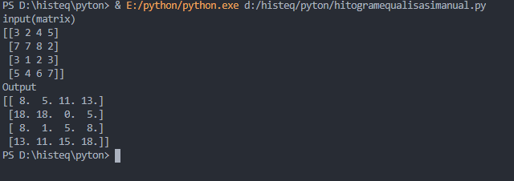

# Histogram Equalization without fungtion in python
menggunakan python dengan library pandas dan math 
output 

code from explanation video below  

#Histogram Equalization <a href="https://www.youtube.com/watch?v=eNBZI-qYhpg">link video</a>
